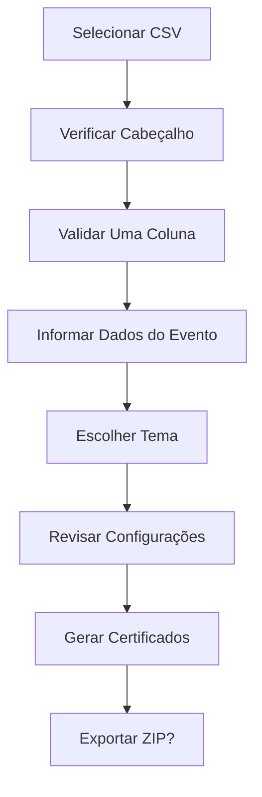
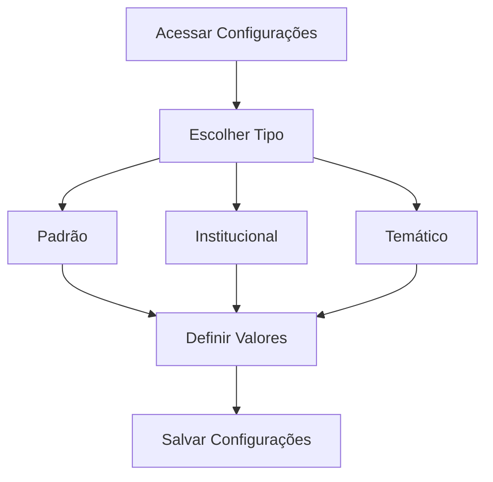
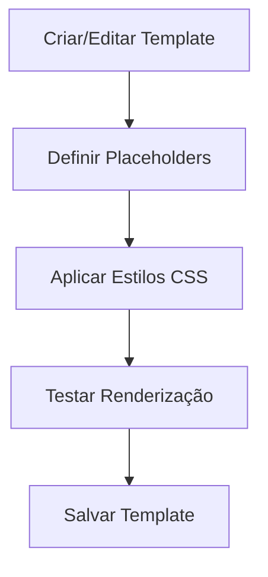

# NEPEMCERT - Documentação Geral

## Visão Geral

NEPEMCERT é uma aplicação CLI (Command Line Interface) desenvolvida em Python para geração automatizada de certificados em lote. O sistema permite criar certificados personalizados em PDF a partir de templates HTML e dados de participantes em arquivos CSV, oferecendo temas customizáveis e um sistema flexível de placeholders.

### Principais Funcionalidades

- 📄 Geração de certificados em PDF a partir de templates HTML
- 📊 Processamento em lote de dados CSV
- 🎨 Sistema de temas personalizáveis
- 🔧 Configuração flexível de placeholders
- 📦 Exportação em arquivo ZIP
- 🖥️ Interface CLI interativa e amigável
- 🔐 Sistema de autenticação seguro com keyring
- 🔗 Integração com servidor para autenticação (em desenvolvimento)

## Stack Técnico

### Linguagem e Versão
- **Python 3.10+** - Linguagem principal do projeto

### Dependências Principais

```txt
click==8.1.8           # Framework para CLI
typer==0.15.4          # Framework moderno para CLI
rich==14.0.0           # Interface rica no terminal
questionary==2.1.0     # Prompts interativos
pandas==2.2.3          # Manipulação de dados CSV
jinja2==3.1.6          # Engine de templates
xhtml2pdf==0.2.17      # Conversão HTML para PDF
watchdog==6.0.0        # Monitoramento de arquivos
zipfile36==0.1.3       # Manipulação de arquivos ZIP
python-slugify==8.0.4  # Geração de slugs
Pillow==11.2.1         # Processamento de imagens
pyfiglet==1.0.2        # Arte ASCII para CLI
tabulate==0.9.0        # Formatação de tabelas
tqdm==4.67.1           # Barras de progresso
colorama==0.4.6        # Cores no terminal
pydantic==2.11.5       # Validação de dados
keyring>=24.0.0        # Armazenamento seguro de credenciais
```

### Ambiente de Desenvolvimento
- **Editor**: Visual Studio Code
- **Sistema Operacional**: Windows, Linux ou macOS

## Arquitetura do Sistema

### Estrutura Modular

O projeto segue uma arquitetura modular com separação clara de responsabilidades:

```
nepemcert/
├── app/                          # Módulos principais
│   ├── template_manager.py       # Gerenciamento de templates
│   ├── pdf_generator.py          # Geração de PDFs
│   ├── parameter_manager.py      # Gerenciamento de parâmetros
│   ├── theme_manager.py          # Gerenciamento de temas
│   ├── csv_manager.py            # Processamento de CSV
│   ├── field_mapper.py           # Mapeamento de campos
│   ├── zip_exporter.py           # Exportação ZIP
│   ├── auth_manager.py           # Gerenciamento de autenticação
│   └── connectivity_manager.py   # Conexões remotas
├── templates/                    # Templates HTML
├── uploads/                      # Arquivos CSV
├── output/                       # Certificados gerados
├── config/                       # Configurações
├── cli.py                        # Interface CLI
└── nepemcert.py                 # Ponto de entrada
```

### Principais Componentes

#### 1. Interface CLI
- **Arquivo**: `cli.py` e `nepemcert.py`
- **Responsabilidade**: Interface de linha de comando com menus interativos
- **Tecnologias**: Click, Typer, Rich, Questionary

#### 2. Gerenciador de Templates
- **Arquivo**: `app/template_manager.py`
- **Responsabilidade**: Gerenciamento e renderização de templates HTML
- **Tecnologias**: Jinja2

#### 3. Gerenciador de PDF
- **Arquivo**: `app/pdf_generator.py`
- **Responsabilidade**: Conversão HTML para PDF
- **Tecnologias**: xhtml2pdf

#### 4. Gerenciador de Parâmetros
- **Arquivo**: `app/parameter_manager.py`
- **Responsabilidade**: Configuração de valores padrão e placeholders
- **Tecnologias**: JSON, Pydantic

#### 5. Gerenciador de Temas
- **Arquivo**: `app/theme_manager.py`
- **Responsabilidade**: Aplicação de estilos e temas
- **Tecnologias**: CSS, JSON

#### 6. Gerenciador de Autenticação
- **Arquivo**: `app/auth_manager.py`
- **Responsabilidade**: Geração e gerenciamento de credenciais de acesso
- **Tecnologias**: keyring, secrets, uuid, Pydantic

## Sistema de Autenticação

### Funcionalidades

O sistema de autenticação oferece:

1. **Geração de Chave Única**
   - Chave criptográfica de 256 bits
   - ID único de instalação
   - Timestamp de criação

2. **Armazenamento Seguro**
   - Chaves armazenadas no keyring do sistema
   - Metadados não-sensíveis em arquivo local
   - Validação com Pydantic

3. **Autenticação com Servidor**
   - Headers Authorization Bearer
   - Identificação única do cliente
   - Controle de expiração

### Configuração Inicial

```bash
# Configurar credenciais pela primeira vez
python nepemcert.py auth setup

# Verificar status de autenticação
python nepemcert.py auth status

# Regenerar credenciais
python nepemcert.py auth setup --force
```

### Estrutura de Credenciais

```json
{
    "client_id": "nepemcert_12345678-1234-1234-1234-123456789abc",
    "installation_id": "87654321-4321-4321-4321-cba987654321",
    "created_at": "2024-01-15T10:30:00",
    "last_used": "2024-01-20T14:45:00"
}
```

## Sistema de Placeholders

### Funcionamento

O sistema utiliza o engine de templates Jinja2 para substituição de placeholders nos templates HTML.

### Tipos de Placeholders

1. **Dados do CSV** (Prioridade 1 - Maior)
   - Valores específicos de cada participante
   - Exemplo: `{{ nome }}`, `{{ email }}`

2. **Placeholders Temáticos** (Prioridade 2)
   - Valores específicos do tema selecionado
   - Exemplo: cores, fontes, estilos

3. **Placeholders Institucionais** (Prioridade 3)
   - Informações da instituição
   - Exemplo: coordenador, diretor, logomarca

4. **Placeholders Padrão** (Prioridade 4 - Menor)
   - Valores globais para todos os certificados
   - Exemplo: textos padrão, formatação básica

### Placeholders Disponíveis

```json
{
    "background_image": "URL da imagem de fundo",
    "title_text": "Texto do título principal",
    "title_font_size": "Tamanho da fonte do título",
    "title_color": "Cor do título",
    "content_font_size": "Tamanho da fonte do conteúdo",
    "name_font_size": "Tamanho da fonte do nome",
    "name_color": "Cor do nome",
    "intro_text": "Texto introdutório",
    "participation_text": "Texto de participação",
    "location_text": "Texto de localização",
    "date_text": "Texto da data",
    "workload_text": "Texto da carga horária",
    "hours_text": "Texto das horas",
    "coordinator_title": "Título do coordenador",
    "director_title": "Título do diretor"
}
```

## Sistema de Temas

### Temas Pré-definidos

1. **Clássico**
   - Design tradicional com cores azuis
   - Adequado para eventos formais

2. **Moderno**
   - Design limpo e contemporâneo
   - Esquema de cores atual

3. **Minimalista**
   - Design simplificado
   - Poucos elementos visuais

4. **Acadêmico**
   - Design formal para instituições de ensino
   - Elementos tradicionais acadêmicos

### Personalização de Temas

Cada tema pode customizar:
- **Cores**: títulos, textos, bordas
- **Fontes**: tamanhos e famílias tipográficas
- **Imagens**: backgrounds e elementos visuais
- **Conteúdo**: textos específicos do tema

## Fluxos de Trabalho

### 1. Geração de Certificados em Lote



#### Passos Detalhados:

1. **Seleção do Arquivo CSV**
   - Arquivo deve conter apenas uma coluna com nomes
   - Sistema verifica presença de cabeçalho
   - Valida formato e estrutura

2. **Coleta de Informações do Evento**
   - Nome do evento
   - Data de realização
   - Local do evento
   - Carga horária

3. **Revisão e Confirmação**
   - Exibição de todos os dados coletados
   - Opção de alterar informações específicas
   - Confirmação final

4. **Seleção de Tema**
   - Escolha entre temas disponíveis
   - Aplicação automática de estilos

5. **Geração dos Certificados**
   - Processamento em lote
   - Geração de códigos de autenticação únicos
   - Criação dos arquivos PDF

6. **Exportação (Opcional)**
   - Compactação em arquivo ZIP
   - Download ou salvamento local

### 2. Configuração de Parâmetros



### 3. Gerenciamento de Templates



## Comandos CLI

### Modo Interativo
```bash
python nepemcert.py interactive
```

### Geração Direta
```bash
python nepemcert.py generate <csv_file> <template> --output <output_dir> --zip
```

### Autenticação
```bash
python nepemcert.py auth setup          # Configurar credenciais
python nepemcert.py auth status         # Verificar status
python nepemcert.py auth revoke         # Revogar credenciais
```

### Verificação do Servidor
```bash
python nepemcert.py server --status
```

### Ajuda
```bash
python nepemcert.py --help
python nepemcert.py generate --help
python nepemcert.py auth --help
```

## Formato de Templates

### Estrutura HTML com Jinja2

```html
<!DOCTYPE html>
<html>
<head>
    <meta charset="UTF-8">
    <style>
        .certificate {
            background-image: url('{{ background_image }}');
            font-family: Arial, sans-serif;
        }
        .title {
            font-size: {{ title_font_size }};
            color: {{ title_color }};
        }
        .name {
            font-size: {{ name_font_size }};
            color: {{ name_color }};
        }
    </style>
</head>
<body>
    <div class="certificate">
        <h1 class="title">{{ title_text }}</h1>
        <p>{{ intro_text }} <span class="name">{{ nome }}</span> {{ participation_text }} <strong>{{ evento }}</strong></p>
        <p>{{ location_text }}: {{ local }}</p>
        <p>{{ date_text }}: {{ data }}</p>
        <p>{{ workload_text }}: {{ carga_horaria }} {{ hours_text }}</p>
    </div>
</body>
</html>
```

## Formato de Dados CSV

### Especificações

- **Estrutura**: Apenas uma coluna com nomes dos participantes
- **Codificação**: UTF-8 obrigatório
- **Cabeçalho**: Opcional (sistema pergunta se existe)
- **Separador**: Vírgula (padrão CSV)

### Exemplo

```csv
Nome
João Silva
Maria Santos
Pedro Oliveira
Ana Costa
```

ou sem cabeçalho:

```csv
João Silva
Maria Santos
Pedro Oliveira
Ana Costa
```

## Configurações

### Arquivo parameters.json

```json
{
    "default_placeholders": {
        "title_text": "CERTIFICADO",
        "intro_text": "Certificamos que",
        "participation_text": "participou do evento",
        "location_text": "Realizado em",
        "date_text": "Data",
        "workload_text": "Carga horária",
        "hours_text": "horas"
    },
    "institutional_placeholders": {
        "coordinator_name": "Prof. Dr. João Coordenador",
        "director_name": "Prof. Dr. Maria Diretora",
        "institution_name": "NEPEM - Núcleo de Estudos",
        "website": "https://nepem.exemplo.com"
    },
    "theme_placeholders": {
        "classico": {
            "title_color": "#003366",
            "name_color": "#0066CC",
            "background_image": "bg-classico.png"
        },
        "moderno": {
            "title_color": "#2C3E50",
            "name_color": "#E74C3C",
            "background_image": "bg-moderno.png"
        }
    }
}
```

### Logs e Depuração

O sistema fornece logs detalhados durante o processamento:
- Número de participantes processados
- Placeholders encontrados e substituídos
- Erros de renderização
- Status da geração de cada certificado

## Roadmap e Funcionalidades Futuras

### Em Desenvolvimento
- Integração completa com servidor de autenticação
- Interface web complementar

### Planejado
- Suporte a múltiplas colunas no CSV
- Editor visual de templates
- Mais temas pré-definidos
- Assinatura digital dos certificados

## Contribuição

Para contribuir com o projeto:
1. Faça fork do repositório
2. Crie uma branch para sua feature
3. Implemente as mudanças
4. Adicione testes se necessário
5. Abra um pull request

## Licença

[Incluir informações sobre a licença do projeto]

---

*Esta documentação é mantida atualizada com as funcionalidades do NEPEMCERT. Para dúvidas ou sugestões, consulte a equipe de desenvolvimento.*
